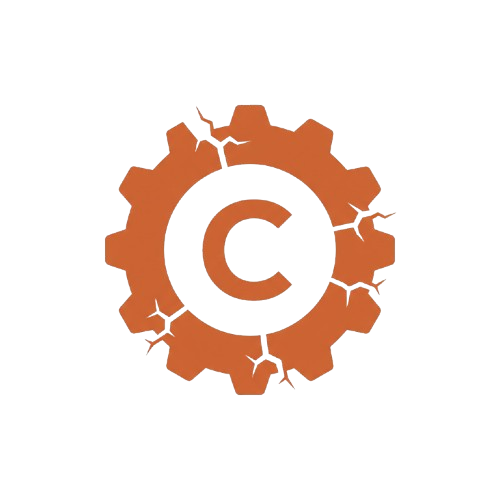

#  Crusty Compiler

A compiler for Crusty, a small expression-oriented language.
Written in Rust.

## The Language

Crusty is a minimal imperative language with Rust and Scala influences. Here's a taste:

```
var n: Int = read_int();
print_int(n);
while n > 1 do {
    if n % 2 == 0 then {
        n = n / 2;
    } else {
        n = 3*n + 1;
    }
    print_int(n);
}
```

### Key features

- Expression-oriented: everything returns a value
- Three types: Int, Bool and Unit
- Lexical scoping with block expressions
- Short-circuit and/or
- Optional type annotations on variables

See the full [language specification](https://hy-compilers.github.io/spring-2026/language-spec/).

## Progress

- [x] Setup
- [x] Tokenizer
- [x] Parser
- [x] Interpreter
- [x] Type checker
- [ ] IR Generator
- [ ] Assembly Generator
- [ ] Analysis & optimization
- [ ] Function definitions
